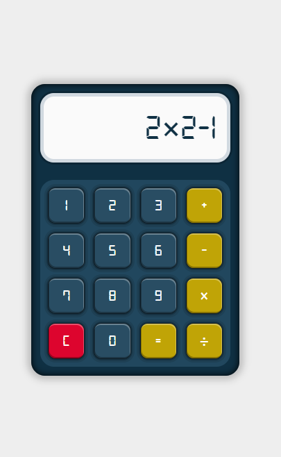

# Calculatrice React.js
 
 Calculatrice réalisée en utilisant React.js, permettant aux utilisateurs d'effectuer des opérations mathématiques de base. Cette application est conçue pour offrir une expérience utilisateur intuitive et réactive.

## Fonctionnalités

- **Opérations de base** : Addition, soustraction, multiplication et division.
- **Calculs instantanés** : Les résultats s'affichent en temps réel à mesure que l'utilisateur entre les chiffres et les opérateurs.
- **Interface conviviale** : Conception propre et minimaliste pour une utilisation facile.

## Capture d'écran

## Installation

1. Clonez ce dépôt sur votre machine locale.
2. Assurez-vous que Node.js est installé sur votre système.
3. Exécutez `npm install` pour installer les dépendances.
4. Lancez l'application en exécutant `npm start`.
5. Ouvrez votre navigateur et accédez à `http://localhost:3000`.

## Technologies utilisées

- React.js
- JavaScript (ES6+)
- HTML5
- SASS

## Auteur

Cette calculatrice a été créée par [Waly le dev](https://github.com/waly2020).

## Lien
Vous pouvez voir un aperçu [sur ce lien](https://calculatrice-r5w2.onrender.com/){:target="_blank"}.